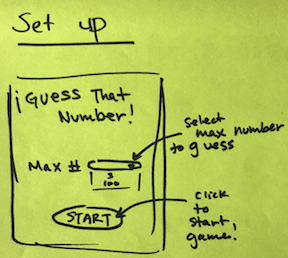
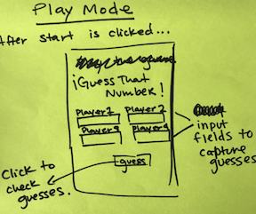

# Team Random Number Guess

Start this group project off with the Quad expectation setting project we did last week. You can refer to [last week's project](https://github.com/PrimeAcademy/object-group-bonus-calculator) for reference. You have a new group, so these expectations might be different. Your needs might change week to week.

### Tech: Node, Express, and JQuery

## Base Mode:
The final version of this project will have two modes:

- setup mode 
- play mode

### Setup Mode

Inputs on the web page: 

- Maximum Number selector (at least 3 options) 
- Start Game button

### Play Mode

- input for a guess for each of the four Players
- submit guesses button
- total guesses made indicator
- maximum number indicator
- details area for the last guess of each player (low/high)
- abandon game button that goes back to setup mode
- if a guess is correct PROMINENTLY Display which player won (make 'em FEEL it)
- restart button that leads to Setup Mode

## Necessary Ingredients
#### AKA Client Demands...

All random number stuff should happen on the server: Generation of the random number upon game start as well as comparisons between guesses and the random correct answer. Have the random number generator be in its own node module, look back at the Module Madness activity to do this. 

Take a moment to discuss with your team members why this is something that a client may demand.

Once you get it working, style it up, yo!

## Hard Mode:
See how many of these you can implement in the given time. Remember to test when applying a feature.

- disallow two users to submit the same guess at the same time
- disallow any guess to be entered more than once
- disallow guesses less than 0 and higher than max
- hot/cold indicators (how can these be styled?, can the hot/cold range be adjusted for the size of the maximum number?)
- allow the choice of number of users
- allow users to create profiles that can include their name and also how many matches they have played/won (win percentage)
- add a bot player that guesses a random number each time in addition to the players (this bot should really talk trash when it beats a bunch of humans)
- what are your ideas? Have some fun with it